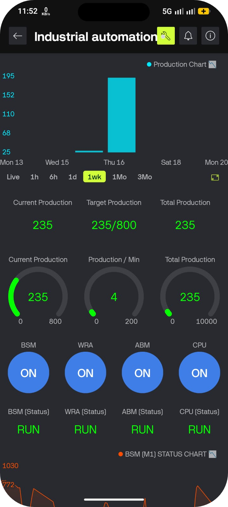
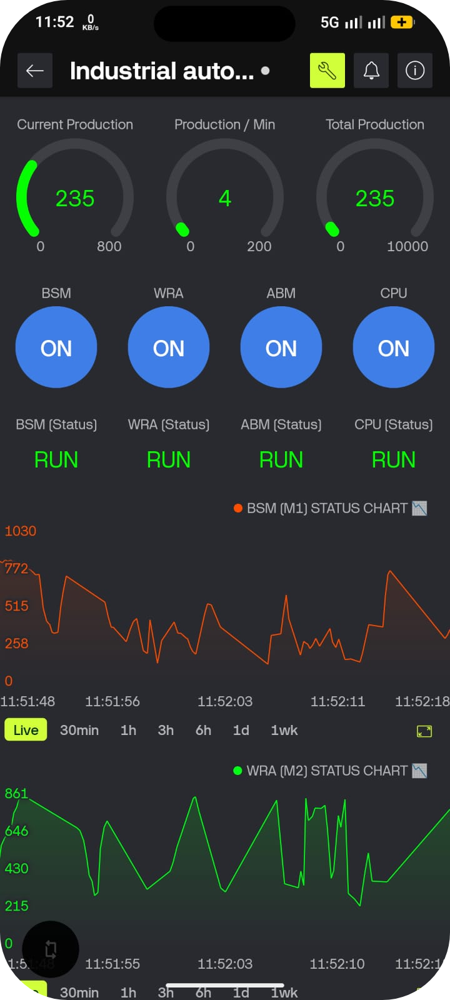
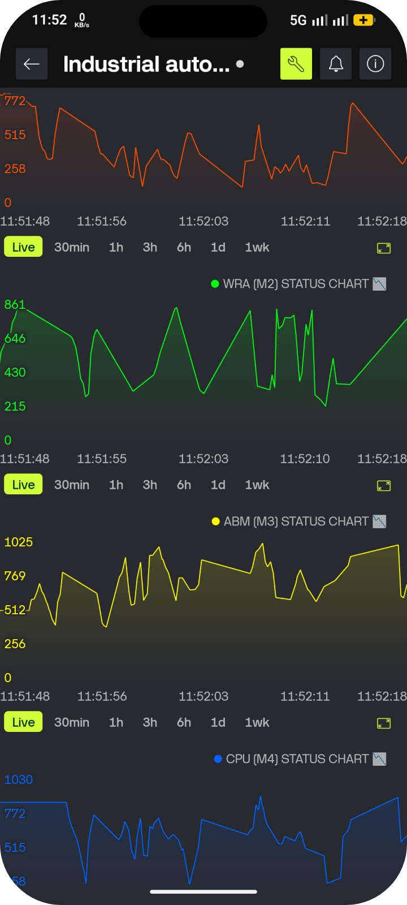
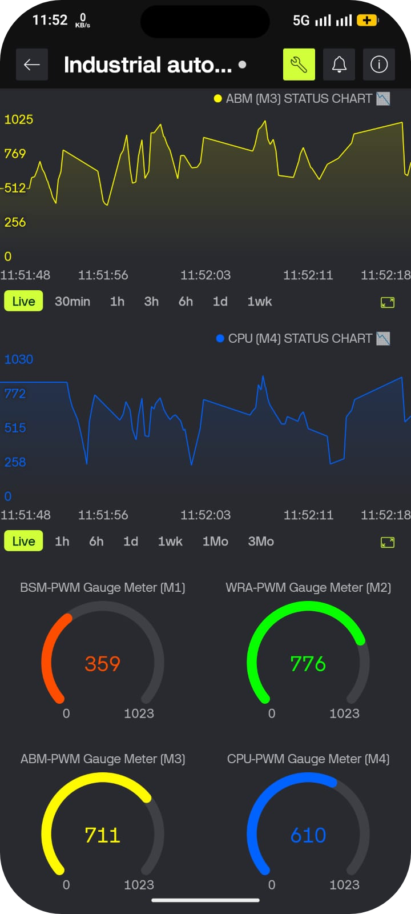
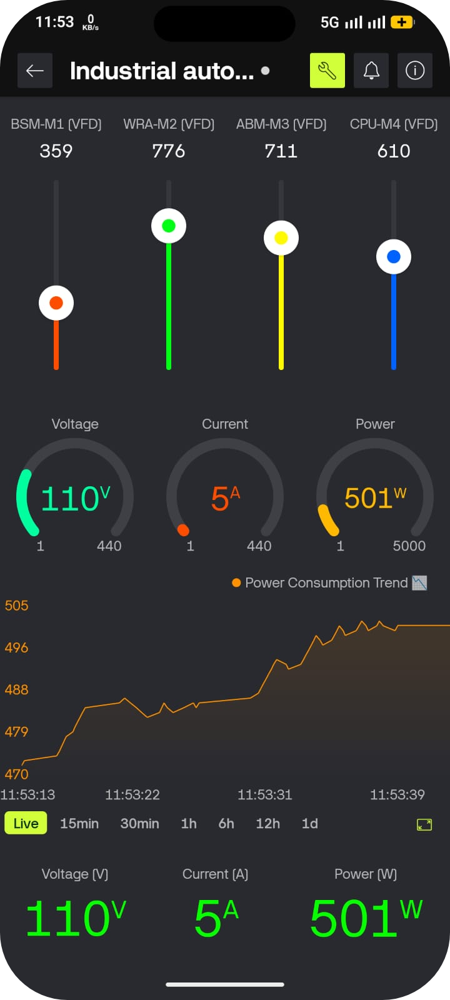
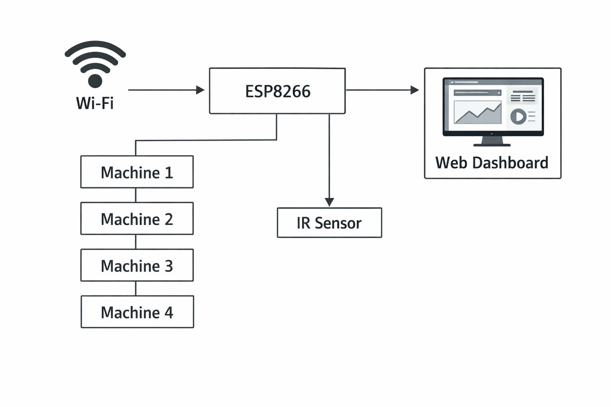
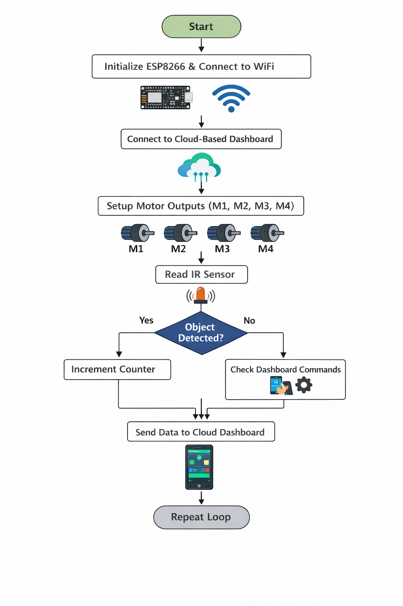

# 🚀 Industrial Automation & Controlled System

## 📱 Dashboard Preview

### 🌐 Web Dashboard

  
  
  

### 📲 Mobile Dashboard

  
  
  
  
  

---

## 📌 Project Overview

This project is an **Embedded-based Industrial Automation & Control System** that monitors and controls 4 machines using IoT (Industrial Dashboard).
It includes **real-time monitoring, production counting, fault detection, and alert system**.

---

## 🧱 Block Diagram

### 📖 Description

- ESP8266 acts as the main controller
- IR Sensor detects production count
- Machines (M1–M4) are controlled via GPIO
- Industrial Dashboard provides remote monitoring and control

---

## 🔌 Circuit Diagram

### 📖 Description

- Machines connected to D1, D2, D5, D6
- IR Sensor connected to D7
- Alarm (Buzzer/LED) connected to D0
- Power supply provided via 3.3V

---

## 🔄 Flowchart

---

## ⚙️ Working Principle

1. System initializes all pins and connects to WiFi
2. Industrial Dashboard syncs machine states and speeds
3. IR sensor detects object and updates production count
4. Interlock logic ensures safe machine operation
5. If any machine stops → alarm is triggered
6. Data is stored in EEPROM for persistence
7. Dashboard shows real-time production and machine status

---

## 🔗 Pin Configuration

- M1 → D1
- M2 → D2
- M3 → D5
- M4 → D6
- IR Sensor → D7
- Alarm → D0

---

## ⚠️ Note

Add your WiFi credentials in `config.h` before running the project.

---

## 💡 Features

✔ Real-time monitoring
✔ IoT control using Blynk
✔ Production counting
✔ Fault detection system
✔ EEPROM data storage
✔ Industrial interlock logic

---

## 🛠️ Tech Used

- ESP8266
- Arduino IDE / VS Code
- Open Source Cloud (With Responsive Frontend, Backend & Database)
- Embedded C

---
