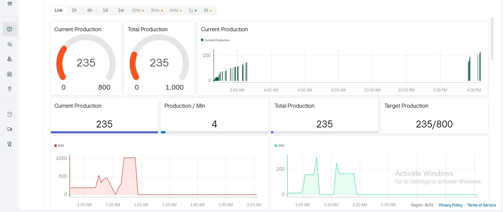
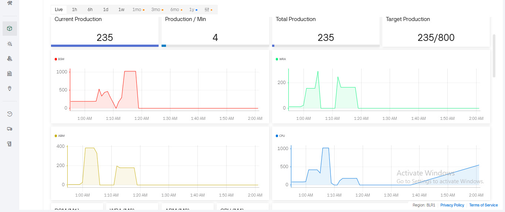
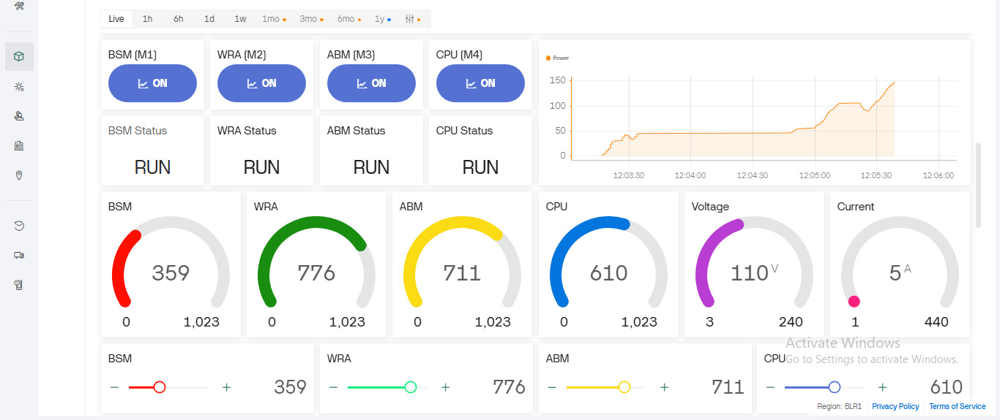
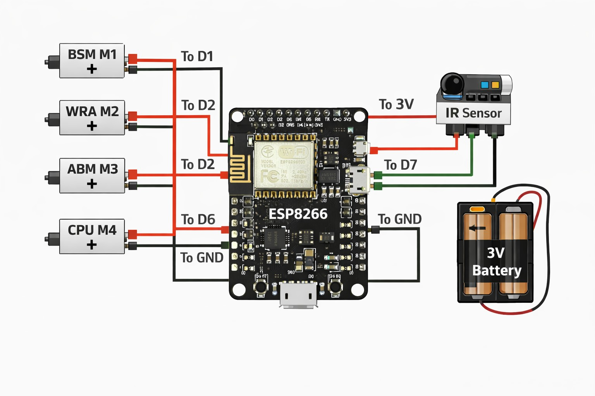

# 🚀 Industrial Automation & Controlled System

## 📱 Dashboard Preview

### 🌐 Web Dashboard

  
  
  

### 📲 Mobile Dashboard

  
  <!--  -->
  
  
  

---

## 📌 Project Overview

This project is an **Embedded-based Industrial Automation & Control System** that monitors and controls multiple machines using IoT (Industrial Dashboard).
It includes **real-time monitoring, production counting, fault detection, and alert system**.

Industrial Automation Suite | DFOS + HMI + EMS
Designed and developed an integrated Industrial Automation platform accessible through a single Web & Mobile dashboard for remote monitoring and control of manufacturing operations.

Key Modules:

### 👉 DFOS (Digital Factory Operating System)

1) Real-time production monitoring for FMCG & manufacturing sectors

2) Tracks total production, target achievement, and per-minute output

3) Detects machine idle time, breakdown duration, and production loss periods

4) Implements Start / Stop / Wait / Block logic for automated workflow control

5) Displays live production analytics and graphs

6) Helps reduce breakdown time and manpower dependency

### 🌐 Web Dashboard For DFOS

  

### 📲 Mobile Dashboard For DFOS

  
  

### 👉 HMI (Human Machine Interface)

1) Real-time machine monitoring and remote control

2) PWM-based machine speed control

3) Displays live and historical machine performance data

4) Tracks machine ON/OFF history and downtime reasons

5) Improves operational efficiency with less manual intervention

### 🌐 Web Dashboard For HMI 

  

### 📲 Mobile Dashboard For HMI 

  
  

### 👉 EMS (Energy Monitoring System)

1) Monitors machine current, voltage, and power consumption live

2) Sends maintenance alerts for abnormal power usage

3) Automatically shuts down machines when power exceeds safety limits

4) Live energy consumption dashboard with trend graphs

5) Supports energy saving and preventive maintenance strategies

### 🌐 Web Dashboard For EMS 

  

### 📲 Mobile Dashboard For EMS 

  

Technologies Used:

ESP8266 / IoT / Sensors / Embedded C++ / Web Dashboard / Firebase / Real-time Database / Automation Logic / Data Visualization

Impact:

Reduced manpower, minimized production loss, improved efficiency, and enabled smart factory remote operations.

---

## 🧱 Block Diagram

### 📖 Description

- ESP8266 acts as the main controller
- IR Sensor detects production count
- Machines (M1–M4) are controlled via GPIO
- Industrial Dashboard provides remote monitoring and control

---

## 🔌 Circuit Diagram

### 📖 Description

- Machines connected to D1, D2, D5, D6
- IR Sensor connected to D7
- Alarm (Buzzer/LED) connected to D0
- Power supply provided via 3.3V

---

## 🔄 Flowchart

---

## ⚙️ Working Principle

1. System initializes all pins and connects to WiFi
2. Industrial Dashboard syncs machine states and speeds
3. IR sensor detects object and updates production count
4. Interlock logic ensures safe machine operation
5. If any machine stops → alarm is triggered
6. Data is stored in EEPROM for persistence
7. Dashboard shows real-time production and machine status

---

## 🔗 Pin Configuration

- M1 → D1
- M2 → D2
- M3 → D5
- M4 → D6
- IR Sensor → D7
- Alarm → D0

---

## ⚠️ Note
> [!NOTE]
>
> Add your WiFi credentials in `config.h` before running the project!

---

## 💡 Features

> [!FEATURES]
>
> ✔ Real-time monitoring
✔ IoT control using Blynk
✔ Production counting
✔ Fault detection system
✔ EEPROM data storage
✔ Industrial interlock logic

---

## 🛠️ Tech Used

- ESP8266
- Arduino IDE / VS Code
- Open Source Cloud (With Responsive Frontend, Backend & Database)
- Embedded C

---
